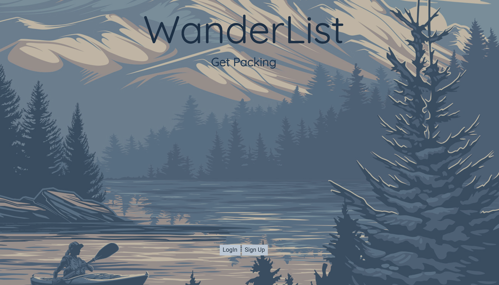
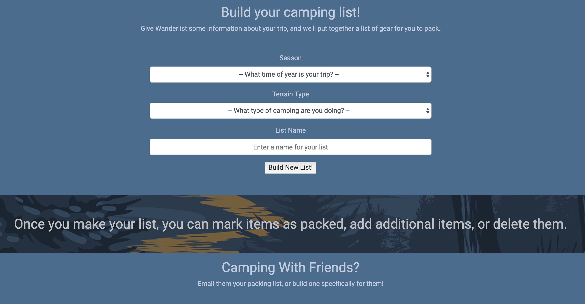

# _WanderList_

#### _Packing App for Camping trips, April 18, 2019_

#### By _**Heather Zurek, Dustin Herboldshimer, Reese Lee**_

## Description

https://heatherzurek.github.io/wanderlist-camping/

_A web application that allows the user to create pre generated lists and edit them based on their trips needs. Would like to continue to add on to this apps functionality by adding user authentication and ability to share the custom camping lists with friends._

## Setup/Installation Requirements

* _URL_
* _Open Web Application in Browser_
* _Select drop down for your trip_
* _Add items to list_

## Specs

| Behavior | Input | Output |
| ------------- |:-------------:| -----:|
| User selects time of year for their trip | Winter | Winter |
| User selects terrain type for their trip | Desert | Winter, Desert |
| User can name their list | Grand Canyon Trip 2020 | Grand Canyon Trip 2020 |
| User can uncheck items they don't want | ☑ Sleeping bag liner | ☐ Sleeping bag liner |
| User can add items to their list | Warm socks | Warm socks |
| User can remove items from their list | Warm socks | |
| User can check off items that are packed | Coffee | Coffee ✓ Packed |

## Known Bugs

_Authentication is non-working, cannot email to multiple users at this moment, please contact us via the contact form if you find any issues._

## Support and contact details

_If you run into any issues or have questions, ideas or concerns please reach out to us via the contact form on the web application._

## Technologies Used

_JavaScript, jQuery, HTML, CSS_

### License

*MIT license*

Copyright (c) 2019 **_Heather Zurek, Dustin Herboldshimer, Reese Lee_**
